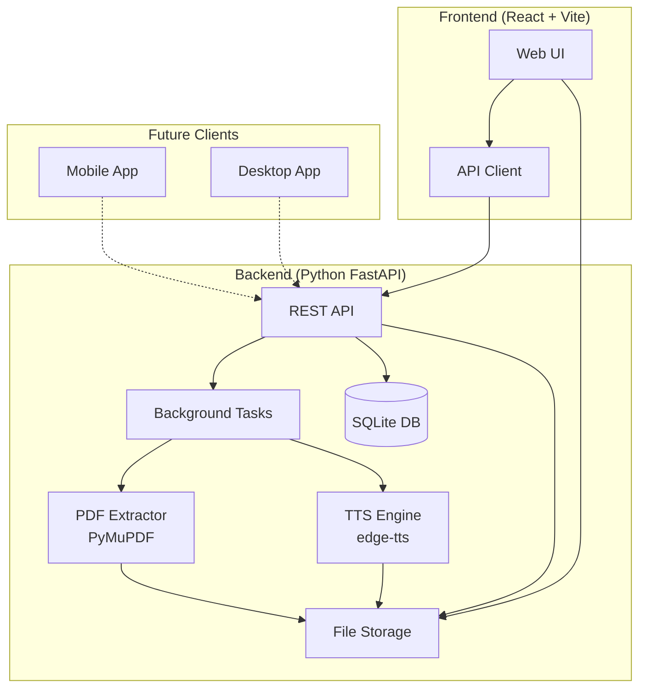
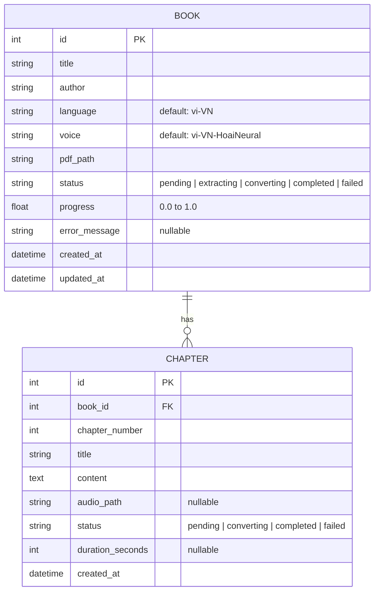
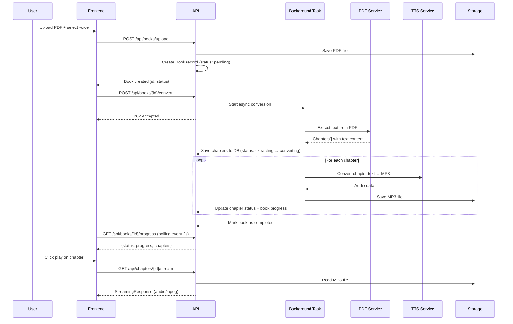

# AudioBook App - Implementation Plan

A free application that converts PDF files into audiobooks with Vietnamese voice reading. Fully separated Backend/Frontend architecture to support future expansion to mobile and desktop apps.

## Architecture Overview



---

## User Review Required

> [!IMPORTANT]
> **TTS Engine: `edge-tts`** — Uses Microsoft Edge's free online TTS service.
> - ✅ **Completely free**, no API key needed
> - ✅ **Vietnamese voices**: `vi-VN-HoaiNeural` (female), `vi-VN-NamMinhNeural` (male)
> - ✅ **40+ languages** supported (English, Japanese, Chinese, etc.)
> - ✅ **Neural voice quality** — very natural sounding
> - ✅ **No GPU required**, very fast
> - ⚠️ **Requires internet** (sends text to Microsoft server for conversion)
> - ⚠️ Excessive usage may trigger temporary rate limiting from Microsoft

> [!NOTE]
> **Simplified Task Queue**: Instead of Celery + Redis (which requires extra infrastructure), I'll use **FastAPI's built-in background tasks + asyncio** for processing. This keeps the setup simple — just run the backend, no Redis needed. Since this is a personal-use app, this approach is perfectly sufficient.

---

## Open Questions

1. **Task Queue Complexity**: I'm defaulting to simple asyncio background tasks (no Redis/Celery). If you later want more robust job management (retries, persistent queue across restarts), we can upgrade to Celery. OK with this approach?

2. **Chapter Detection**: PDFs vary wildly in structure. I'll implement basic chapter detection (TOC-based, heading-based, and fallback to fixed-size chunks). Some PDFs may need manual chapter splitting. Acceptable?

---

## Tech Stack

| Layer | Technology | Reason |
|-------|-----------|--------|
| **Backend** | Python 3.11+ / FastAPI | Async, fast, easy API development |
| **PDF → Text** | PyMuPDF (fitz) | Fastest, free, handles most PDFs well |
| **Text → Speech** | edge-tts | Free, Vietnamese support, high quality |
| **Database** | SQLite (SQLAlchemy ORM) | Simple, zero setup, perfect for personal use |
| **Task Processing** | asyncio background tasks | No extra infrastructure needed |
| **Frontend** | React + Vite + TypeScript | Fast, modern, type-safe |
| **Audio Player** | HTML5 Audio + custom UI | Built-in browser support |
| **File Storage** | Local filesystem | Simple for personal use |
| **Containerization** | Docker Compose | One-command setup |

---

## Proposed Changes

### Backend (Python FastAPI)

#### [NEW] `backend/` directory structure

```
backend/
├── app/
│   ├── __init__.py
│   ├── main.py              # FastAPI app entry point
│   ├── config.py             # Settings & configuration
│   ├── database.py           # SQLAlchemy setup
│   ├── models/
│   │   ├── __init__.py
│   │   └── book.py           # Book, Chapter models
│   ├── schemas/
│   │   ├── __init__.py
│   │   └── book.py           # Pydantic request/response schemas
│   ├── api/
│   │   ├── __init__.py
│   │   ├── router.py         # Main API router
│   │   ├── books.py          # Book CRUD endpoints
│   │   └── audio.py          # Audio streaming endpoints
│   ├── services/
│   │   ├── __init__.py
│   │   ├── pdf_service.py    # PDF text extraction
│   │   ├── tts_service.py    # Text-to-speech conversion
│   │   └── book_service.py   # Business logic orchestration
│   └── storage/              # Generated files (PDFs, MP3s)
│       └── books/
├── requirements.txt
└── Dockerfile
```

#### Database Schema



#### REST API Endpoints

| Method | Endpoint | Description |
|--------|----------|-------------|
| `POST` | `/api/books/upload` | Upload a PDF file, select voice/language |
| `GET` | `/api/books` | List all books with status |
| `GET` | `/api/books/{id}` | Get book detail including chapters |
| `DELETE` | `/api/books/{id}` | Delete book and all associated files |
| `POST` | `/api/books/{id}/convert` | Start or retry TTS conversion |
| `GET` | `/api/books/{id}/progress` | Get conversion progress (for polling) |
| `GET` | `/api/chapters/{id}/stream` | Stream chapter audio (supports range requests) |
| `GET` | `/api/chapters/{id}/download` | Download chapter as MP3 |
| `GET` | `/api/voices` | List available TTS voices |

#### Key Service Details

##### PDF Service (`pdf_service.py`)
- Uses **PyMuPDF** to extract text from uploaded PDFs
- Attempts chapter detection via:
  1. PDF Table of Contents (TOC) metadata
  2. Font-size based heading detection
  3. Regex patterns (e.g., "Chapter 1", "Part I")
  4. Fallback: split into ~3000-word chunks
- Cleans extracted text: removes headers/footers, page numbers, excessive whitespace
- Handles scanned PDFs gracefully (returns error suggesting OCR)

##### TTS Service (`tts_service.py`)
- Uses **edge-tts** async API for text-to-speech conversion
- Default voice: `vi-VN-HoaiNeural` (Vietnamese female)
- Supports configurable: voice selection, speed, pitch
- Splits long chapters into segments (~5000 chars) to avoid timeouts
- Concatenates segments using **pydub** into single MP3 per chapter
- Reports progress via callback for real-time UI updates

##### Book Service (`book_service.py`)
- Orchestrates the full conversion pipeline:
  1. Save uploaded PDF → extract text → create chapters in DB
  2. For each chapter: convert text → MP3 via TTS
  3. Update progress after each chapter completes
  4. Handle errors gracefully (mark failed chapters, allow retry)
- Runs as asyncio background task (non-blocking)

---

### Frontend (React + Vite + TypeScript)

#### [NEW] `frontend/` directory structure

```
frontend/
├── src/
│   ├── main.tsx
│   ├── App.tsx
│   ├── index.css              # Global styles & design tokens
│   ├── api/
│   │   └── client.ts          # API client (fetch-based)
│   ├── components/
│   │   ├── Layout/
│   │   │   ├── Sidebar.tsx    # Navigation sidebar
│   │   │   └── Header.tsx     # Top header bar
│   │   ├── AudioPlayer/
│   │   │   └── AudioPlayer.tsx    # Persistent bottom player
│   │   ├── BookCard/
│   │   │   └── BookCard.tsx   # Book thumbnail card
│   │   ├── Upload/
│   │   │   └── UploadModal.tsx # PDF upload with drag & drop
│   │   └── ChapterList/
│   │       └── ChapterList.tsx # Chapter listing with status
│   ├── pages/
│   │   ├── Library.tsx        # Main library grid view
│   │   ├── BookDetail.tsx     # Book detail + chapter player
│   │   └── Settings.tsx       # Voice & playback settings
│   ├── hooks/
│   │   ├── useAudioPlayer.ts  # Audio playback logic
│   │   └── useBooks.ts        # Book data fetching
│   ├── store/
│   │   └── playerStore.ts     # Global player state (Zustand)
│   └── types/
│       └── index.ts           # TypeScript interfaces
├── package.json
├── vite.config.ts
└── tsconfig.json
```

#### UI Layout Concept

```
┌──────────────────────────────────────────────────────┐
│  🎧 AudioBook                         ⚙️  🌙/☀️    │
├──────────┬───────────────────────────────────────────┤
│          │                                           │
│ 📚 Library│   ┌───────┐ ┌───────┐ ┌───────┐         │
│          │   │  📖   │ │  📖   │ │  📖   │         │
│ 🕐 Recent │   │ Book1 │ │ Book2 │ │ Book3 │         │
│          │   │  75%  │ │ Done  │ │  New  │         │
│ ➕ Upload │   └───────┘ └───────┘ └───────┘         │
│          │                                           │
│          │   Chapters                                │
│          │   ├── Ch 1: Introduction      ▶️  05:30  │
│          │   ├── Ch 2: Getting Started   ▶️  12:45  │
│          │   ├── Ch 3: Deep Dive         🔄  ...    │
│          │   └── Ch 4: Conclusion        ⏳  Queue  │
│          │                                           │
├──────────┴───────────────────────────────────────────┤
│  ◀◀  ▶️  ▶▶  │  ━━━━━━━━●━━━━━━━━━  │  🔊 ████░░  │
│  Chapter 2    │  05:23 / 12:45       │  Speed: 1x  │
└──────────────────────────────────────────────────────┘
```

#### Design System
- **Theme**: Dark mode primary with light mode toggle
- **Style**: Glassmorphism cards, subtle gradients (purple → blue)
- **Typography**: Inter font family (Google Fonts)
- **Animations**: Smooth transitions, micro-interactions on hover
- **Layout**: Responsive, works on mobile browsers
- **Player**: Spotify-like persistent bottom audio bar
- **Colors**: Curated dark palette with vibrant accent colors

#### Key Frontend Features
1. **Library View**: Grid of book cards showing cover, title, conversion status/progress
2. **Upload Modal**: Drag & drop PDF upload, voice selection dropdown (Vietnamese voices default)
3. **Book Detail**: Chapter list with play buttons, conversion progress bars
4. **Audio Player**: Persistent bottom bar — play/pause, seek, next/prev chapter, speed control, volume
5. **Playback Memory**: Remembers last position per book (localStorage)
6. **Auto-play**: Automatically plays next chapter when current one finishes

---

### Docker Setup

#### [NEW] `docker-compose.yml`

```yaml
services:
  backend:
    build: ./backend
    ports:
      - "8000:8000"
    volumes:
      - ./storage:/app/storage
      - ./data:/app/data
    environment:
      - DATABASE_URL=sqlite:///./data/audiobook.db

  frontend:
    build: ./frontend
    ports:
      - "3000:3000"
    depends_on:
      - backend
```

> [!NOTE]
> No Redis or Celery containers needed — background tasks run inside the backend process using asyncio. This significantly simplifies deployment.

---

## Processing Flow



---

## Development Phases

### Phase 1: Core Backend (2-3 days)
- [ ] Initialize FastAPI project with proper structure
- [ ] Set up SQLAlchemy models + SQLite database
- [ ] Implement PDF extraction service (PyMuPDF)
- [ ] Implement TTS service (edge-tts, Vietnamese default)
- [ ] Implement background task conversion pipeline
- [ ] Build REST API endpoints (upload, list, progress, stream)
- [ ] Add audio streaming with range request support
- [ ] Basic error handling and logging

### Phase 2: Frontend (2-3 days)
- [ ] Initialize React + Vite + TypeScript project
- [ ] Build design system (dark theme, CSS tokens, typography)
- [ ] Implement Library page (book grid with status cards)
- [ ] Build Upload modal (drag & drop, voice selection)
- [ ] Build Book Detail page (chapter list + progress)
- [ ] Build persistent audio player (bottom bar)
- [ ] Implement progress polling and real-time status updates
- [ ] Connect all API endpoints

### Phase 3: Polish & Deployment (1-2 days)
- [ ] Docker Compose setup for one-command deployment
- [ ] Error handling improvements + retry logic for failed chapters
- [ ] Playback position persistence (remember where user left off)
- [ ] Speed control and voice settings page
- [ ] Responsive design optimization for mobile
- [ ] Final testing with various PDF types

### Phase 4: Future Enhancements (optional)
- [ ] Mobile app (React Native or Flutter)
- [ ] Desktop app (Electron or Tauri)
- [ ] Offline TTS fallback (Piper TTS)
- [ ] Bookmarks and notes
- [ ] Multiple user support
- [ ] PDF OCR support for scanned documents

---

## Verification Plan

### Automated Tests
```bash
# Backend unit tests
cd backend && pytest tests/ -v

# Frontend build verification
cd frontend && npm run build

# Full stack via Docker
docker compose up --build
```

### Manual Verification
1. Upload a Vietnamese PDF → verify text extraction accuracy
2. Upload an English PDF → verify text extraction works
3. Run conversion → verify Vietnamese audio quality and chapter splitting
4. Play audio → verify streaming, seeking, chapter navigation
5. Test on mobile browser → verify responsive layout
6. Test error cases: corrupt PDF, empty PDF, very large PDF
